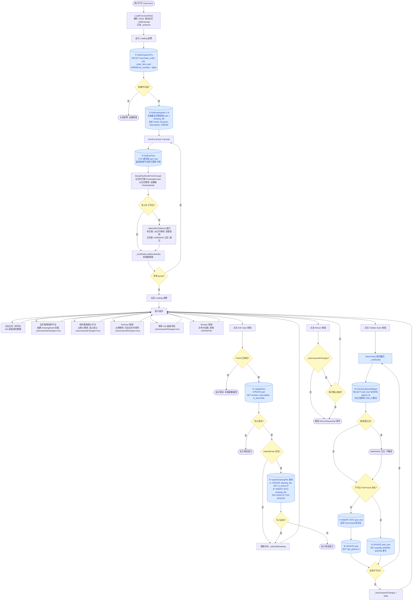
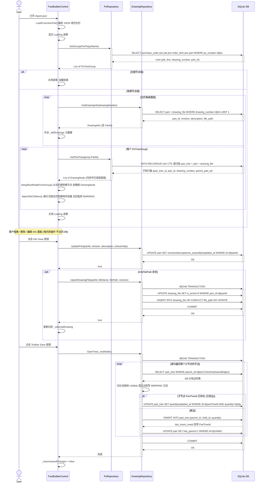

# TreeBuilderControl 功能分析

## 活动图

---

## 时序图

---

## 数据库交互汇总

| # | 触发时机 | 方法 | 表操作 |
|---|---------|------|--------|
| ① | 打开 import.json | `GetGroupsForPo` | SELECT purchase_order / job / order_item / part |
| ② | 同上，为左栏每张图纸逐条查询 | `GetDrawingInfo × N` | SELECT part + drawing_file |
| ③ | 每个根节点各查一次 | `GetPartTree` | SELECT part_tree（CTE 递归）+ part + drawing_file |
| ④ | 点击 Info Save | `UpdatePart` | UPDATE part |
| ⑤ | 点击 Info Save 且有文件路径 | `UpsertDrawingFile` | UPDATE drawing_file（is_active=0）+ INSERT/UPDATE drawing_file（事务）|
| ⑥ | 点击 Toolbar Save，已有边 | `SaveTree` 内部 | UPDATE part_tree（quantity 变化时）|
| ⑦ | 点击 Toolbar Save，新边 | `SaveTree` 内部 | INSERT part_tree |
| ⑧ | 同⑦，随新边一起写 | `SaveTree` 内部 | UPDATE part SET has_parent=1 |
| ⑨ | Toolbar Save 处理每个父节点时 | `CheckOrphanedEdges` | SELECT part_tree（孤立边检测，只读）|
